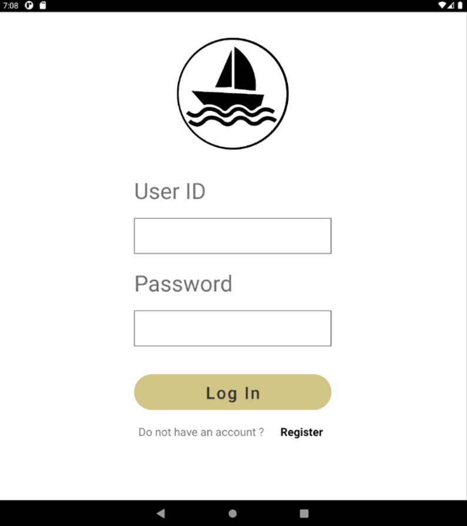
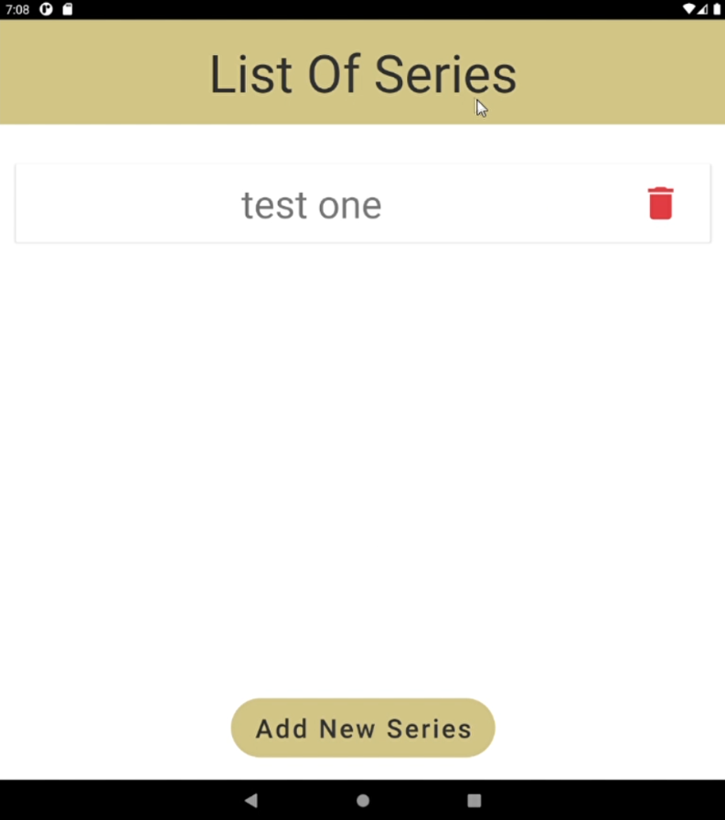
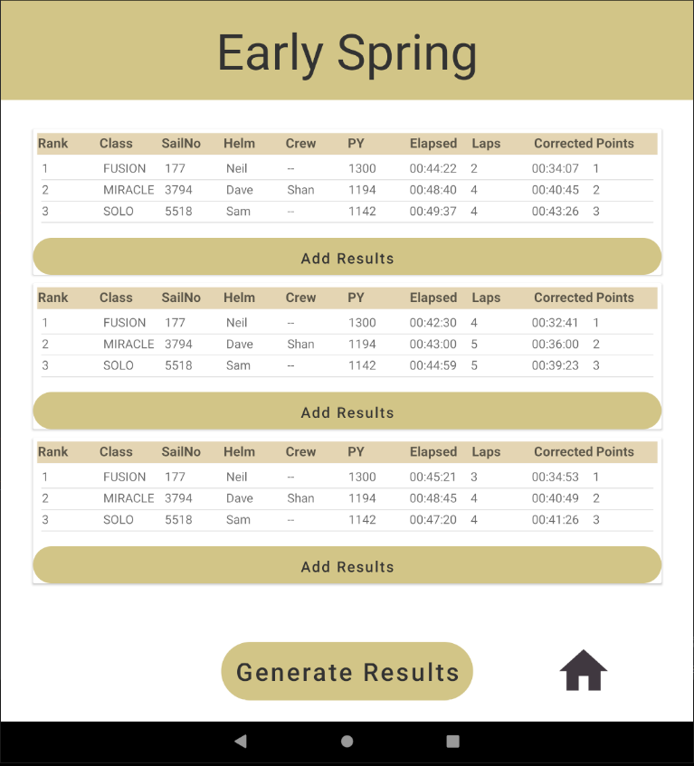
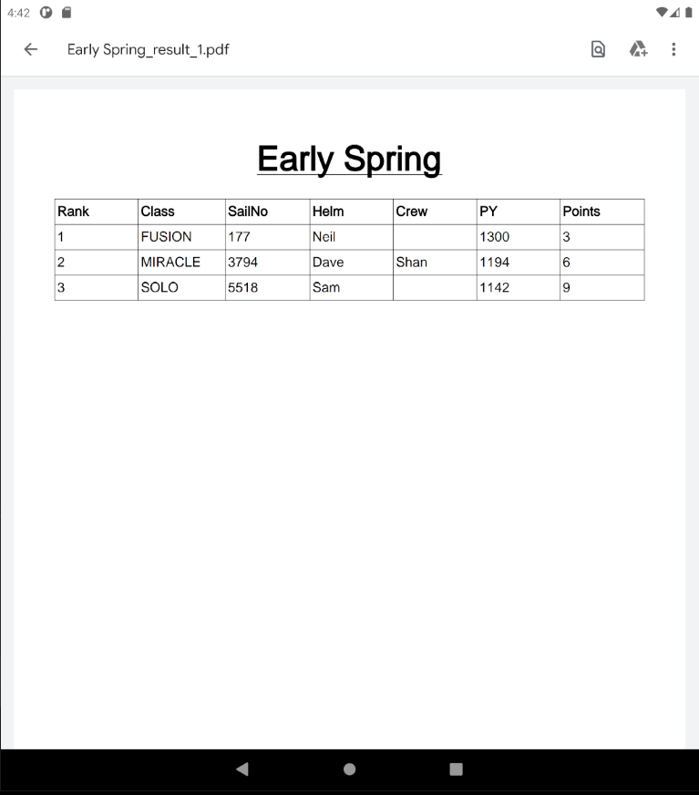

# SailHub
Android application to help sailing clubs to record and generate results easily.

Sailing clubs traditionally use pen and paper for the recording of race results,
these are then manually typed into SailWave so that the results can be calculated
and published. SailWave is used internationally at all levels of the sport, from
sailing club racing to world championships. This results in a complex software 
as it needs to meet all the requirements.

## Android Application Features 
- Create new series with multiple races and competitors.
- Enter and edit details as per requirements.
- View series results at any time (if series not complete, it diplays winner at that given moment) 
- Intutive environment for easy data entry and navigation(average age of users is 60).
- Option to generate PDF.

## Screenshots

